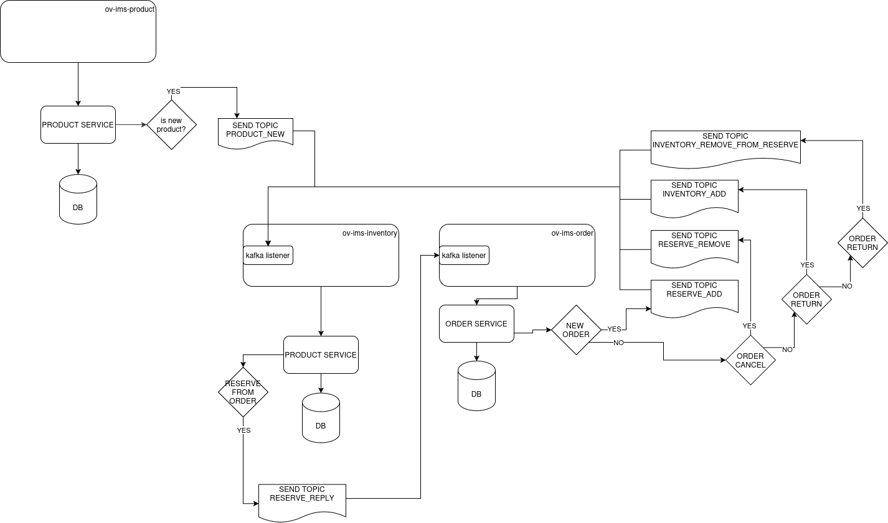

# Inventory Management System

Microsservice RESTful API for inventory management.

- Java 21
- Spring
- Spring Security
- PostgreSQL
- Kafka

## Architecture
1. Controller
   1. REST entrypoint
2. Domain
   1. entities
3. Service
   1. business logic, validation
   2. communication between controller, repository and asynchronous topic consuming/producing
4. Persistence
   1. Data JPA / Hibernate

# Fluxogram
